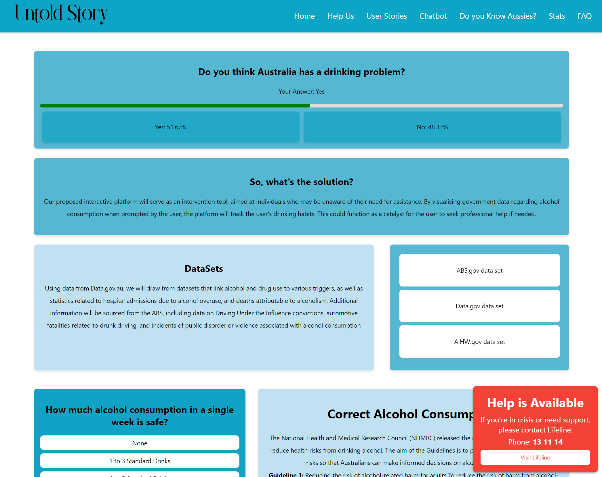
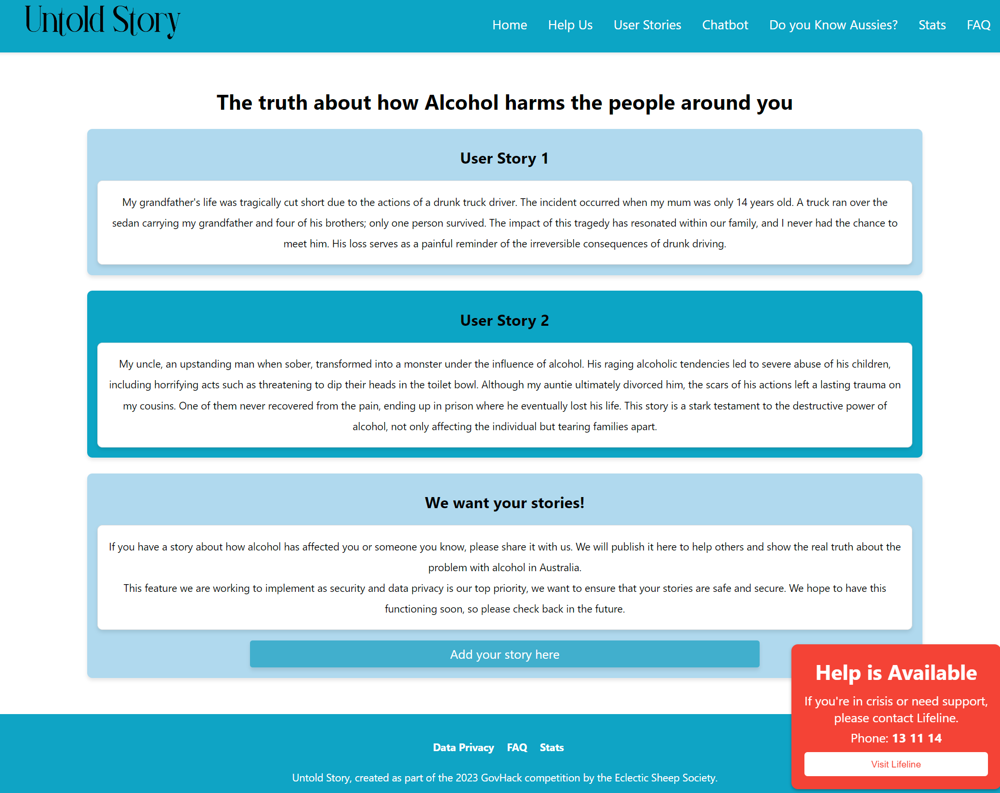
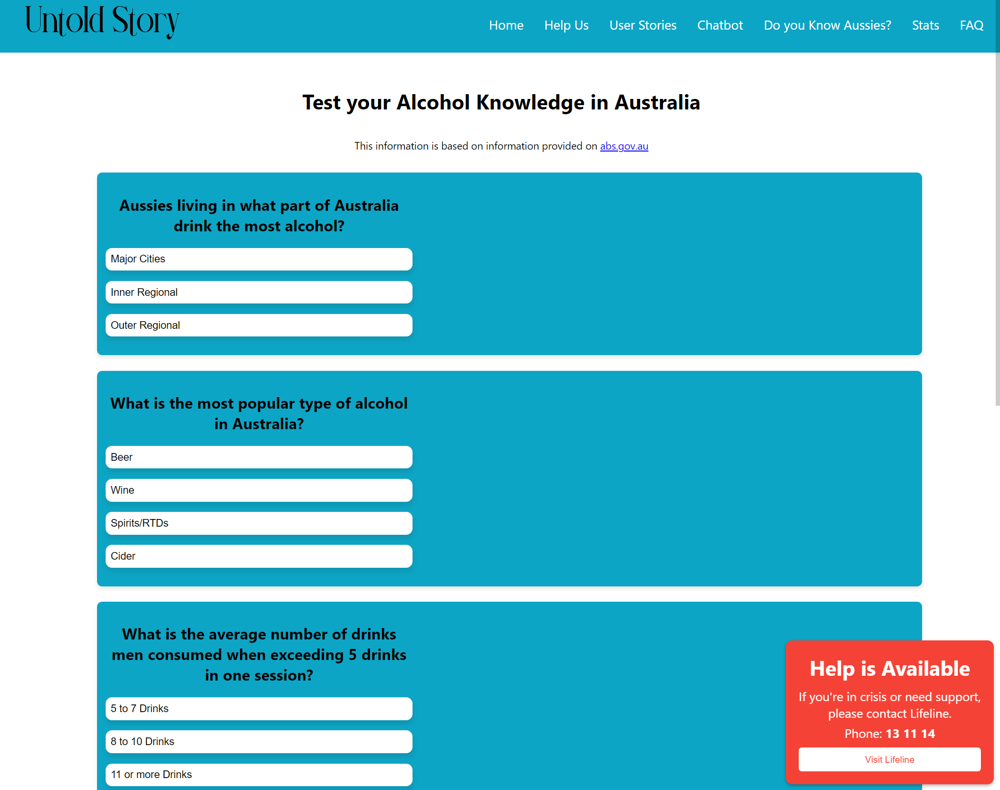
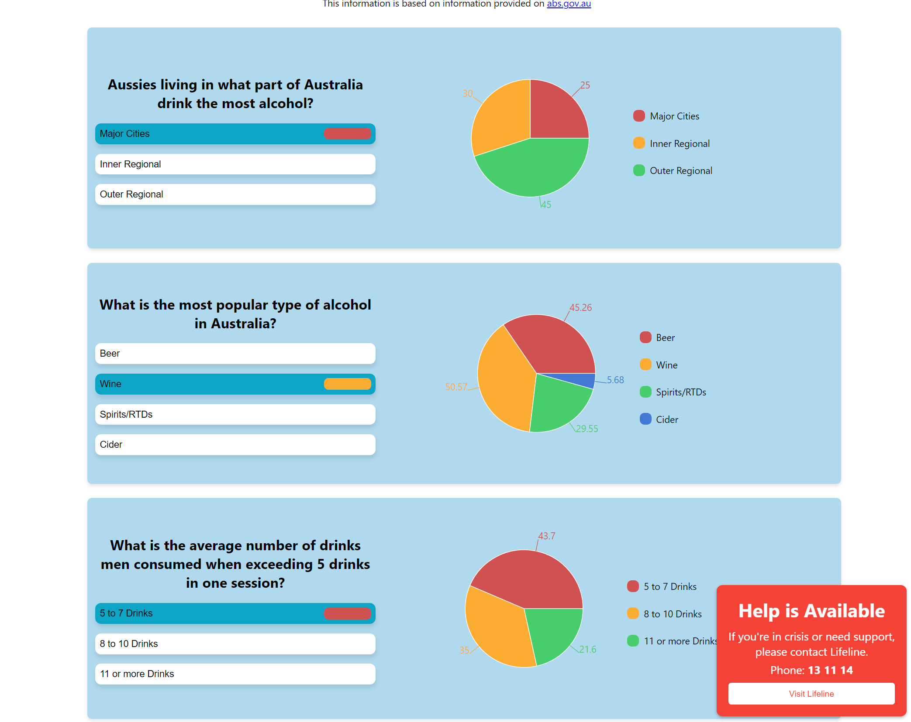
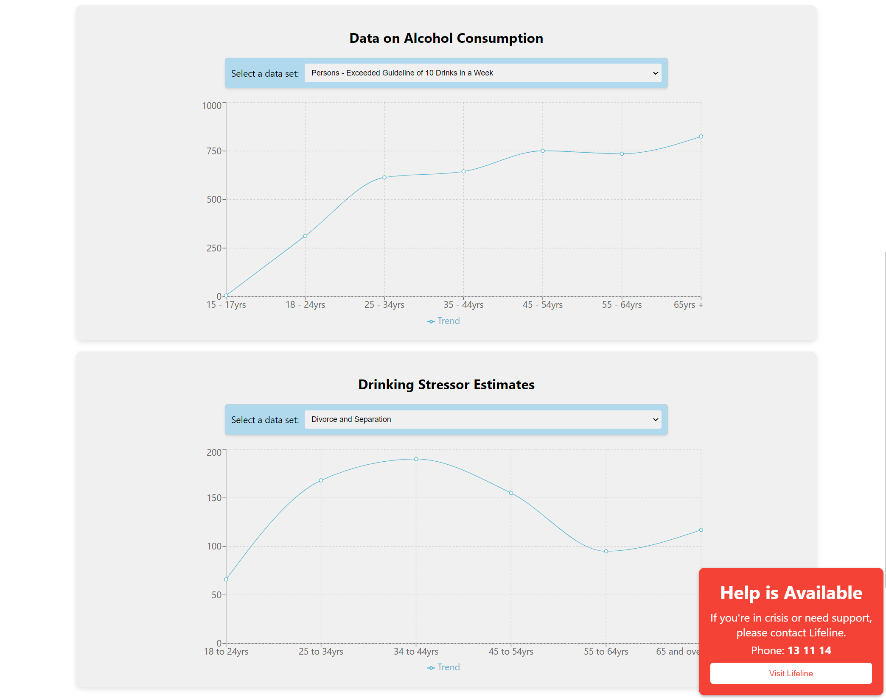
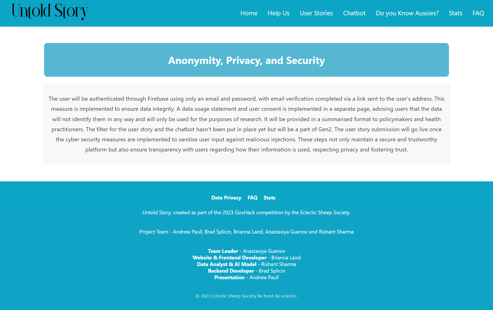

# UNTOLDSTORY.COM.AU

## The Data Story

The data landscape on alcohol addiction in Australia, gathered from sources like Data.gov.au, AIHW, ABS, and others, has long been constrained by its focus on external indicators such as hospital admissions, doctor visits, and law enforcement reports. While the National Health Survey did attempt to collect more personal information like height, weight, BMI, and pre-existing health conditions, its sample size of just 11,000 is glaringly inadequate for a country with a population of over 25 million. This limitation means that the dataset tends to surface only in the direst of circumstances – late stages of liver cancer, fatalities, and other tragic outcomes.

What's been missing from this data story is the voice of the individual, the firsthand experience of those grappling with addiction. This absence not only hampers our ability to develop accurate predictive models but also underscores a broader failure to understand and engage with addiction at its roots.

The **"Untold Story"** initiative recognises the need to shift this paradigm. By fostering an environment where self-reporting is encouraged and anonymity is maintained, we can begin to gather data that reflects the true complexity and humanity of alcohol addiction. This richer dataset will not only enhance our predictive capabilities through machine learning but also support a more compassionate and informed approach to addiction policy and treatment.

## Problem Statement

The untold personal stories of alcohol addiction in Australia lead to gaps in data, hindering a complete approach to tackling the problem. The alcohol culture in Australia is deeply embedded, and the shame and judgment associated with addiction conceal the true extent of the problem. Often referred to as an "alcohol culture," drinking is woven into the fabric of society, and abstinence can be stigmatized. This complex relationship with alcohol leads to obscured statistics, making it challenging to understand the full scope of the issue. The available data often represents the aftermath of alcoholism rather than the personal experiences that might provide insight into the causes.

## Our Solution

**Untold Story** is an innovative web-hosted platform using GenAI, a human-like machine that offers empathy without judgment. Users share their personal experiences with alcohol, and this information creates a newly formed database. By applying machine learning to this database, users can assess their risks, while health practitioners, researchers, and policymakers gain critical insights. It's a groundbreaking approach that forges a direct connection between personal experiences and a broader understanding of Australian Alcohol addiction.

## App Features

### Chatbot

The platform features an LLM chatbot pre-loaded with links from ABS and AIHW databases, as well as databases concerning alcohol-related health and mental health issues. Users can submit an alcohol-related query in natural language, which is sent to Amazon Kendra, connecting it to the relevant database. Context is then passed to Sagemaker, which uses its capabilities to return the answer to the user in natural language. User input is always sanitized to ensure anonymity, and this data contributes to building the overall database. The chatbot will be continuously tweaked to enhance the user experience, and compliance with laws and regulations will be maintained by updating filters and authentication to the latest standards. It will be continuously checked against bias and ethical usage of AI's considerations. Additionally, the chatbot offers helpful service links and guidance on speaking to someone about addiction, providing empathetic support like a buddy on the path to sobriety. This innovative approach to user interaction blends technological sophistication with a human touch, creating a powerful tool for both information and support.

### User Story

Users can share their story about alcohol addiction, whether personal or about a loved one. A special filter ensures that the user's input is depersonalized, maintaining anonymity and protecting privacy. These individual stories, filled with vital insights into alcohol addiction, are added to a relational database. This innovative approach contributes to creating a comprehensive snapshot of Australian Alcohol addiction, blending personal experiences with a broader understanding.

### Interactive Snapshot into Australian Alcohol Addiction

The platform includes a page where users can view a snapshot of the current state of alcoholism addiction in Australia by answering quiz questions. This information is drawn from open-source government databases, allowing real-time insight into the issue. It's an innovative way to connect users with credible information and broaden understanding.

  
  

### Live Statistics

Users can view live graphs correlating to their own age groups and genders by selecting options from the drop-down menus. These statistics showcase the average amount of alcohol consumed, the favorite types of alcohol, and the most common triggers. By presenting this information in an accessible and personalized way, users may feel connected to a digital community they didn't know about, and possibly gain a better understanding of where they stand in terms of the data. It's another way this platform is innovating user engagement with real-world issues.

### Anonymity, Privacy, and Security

The user will be authenticated through Firebase using only an email and password, with email verification completed via a link sent to the user's address. This measure is implemented to ensure data integrity. A data usage statement and user consent are implemented on a separate page, advising users that the data will not identify them in any way and will only be used for the purposes of research. It will be provided in a summarized format to policymakers and health practitioners. The filter for the user story and the chatbot hasn't been put in place yet but will be a part of Gen2. The user story submission will go live once the cybersecurity measures are implemented to sanitize user input against malicious injections. These steps not only maintain a secure and trustworthy platform but also ensure transparency with users regarding how their information is used, respecting privacy and fostering trust.

### Scalability

Alcohol is just the start. The platform's design and structure allow for scalability to shine a light into other gray areas of under-reported and misrepresented data. These areas could include, but are not limited to, mental health conditions, gambling, and crime at home.

### Data Governance

Keeping the data within Australia is a priority for the platform, ensuring that the insights and information gathered are utilized to make Australia a better place. Rather than outsourcing or relying on overseas data handling, the platform is committed to national data governance.

## About Us: Eclectic Sheep Society

The Eclectic Sheep Society is more than just a team; it's a vibrant community of energetic, highly motivated individuals who crave positive change in the world. Hailing from all walks of life and spanning across three Australian states and India, we truly embody the definition of eclectic.

Our journey began at university, where our diverse interests in Data Science, Software Development, Web Design, AI and Machine Learning, Cyber Security, and Criminology brought us together. What unites us is not just our passion for technology but our shared values and life experiences.

Many of us are mature-age students who re-discovered our love for tech later in life. This

 blend of life wisdom and technical expertise sets us apart and fuels our creativity.

At the heart of our mission is the well-being and cohesiveness of our team members. Inclusion, respect, and the freedom to be heard are not just words to us; they are our guiding principles. We build projects inspired by our personal life paths and experiences. Winning is great, but for us, the true victory lies in the learning and the growth we achieve together.
